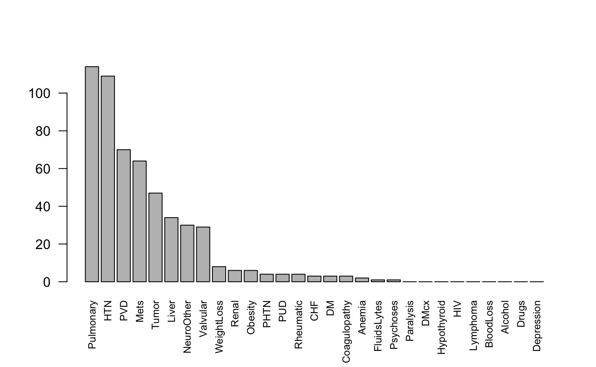

<!--
Copyright (C) 2014 - 2019  Jack O. Wasey

This file is part of icd.

icd is free software: you can redistribute it and/or modify
it under the terms of the GNU General Public License as published by
the Free Software Foundation, either version 3 of the License, or
(at your option) any later version.

icd is distributed in the hope that it will be useful,
but WITHOUT ANY WARRANTY; without even the implied warranty of
MERCHANTABILITY or FITNESS FOR A PARTICULAR PURPOSE. See the
GNU General Public License for more details.

You should have received a copy of the GNU General Public License
along with icd. If not, see <http:#www.gnu.org/licenses/>.
-->

<!-- README.md is generated from README.Rmd. Please edit that file and render with rmarkdown::render("README.Rmd")
-->

# icd

<!-- badges: start -->

[](https://cran.r-project.org/package=icd)
[](https://www.tidyverse.org/lifecycle/#stable)
[](https://www.repostatus.org/#active)
[](https://travis-ci.org/jackwasey/icd)
[](https://ci.appveyor.com/project/jackwasey/icd/branch/master)
[](https://codecov.io/github/jackwasey/icd?branch=master)
[](https://bestpractices.coreinfrastructure.org/projects/2092)
[](https://cran.r-project.org/package=icd)
[](https://cran.r-project.org/package=icd)
<!-- badges: end -->
<!-- [](https://cran.r-project.org/package=icd) -->

# Comorbidities from ICD-9 and ICD-10 codes, manipulation and validation

## Introduction

Calculate comorbidities, medical risk scores, and work very quickly and
precisely with ICD-9 and ICD-10 codes. This package enables a work flow
from raw tables of ICD codes in hospital databases to comorbidities.
ICD-9 and ICD-10 comorbidity mappings from Quan (Deyo and Elixhauser
versions), Elixhauser and AHRQ included. Common ambiguities and code
formats are handled. Comorbidity computation includes Hierarchical
Condition Codes, and an implementation of AHRQ Clinical Classifications.
Risk scores include those of Charlson and van Walraven. US Clinical
Modification, Word Health Organization, Belgian and French ICD-10 codes
are supported, most of which are downloaded on demand.

`icd` is used by many researchers around the world who work in public
health, epidemiology, clinical research, nutrition, journalism, health
administration and more. I’m grateful for contact from people in these
fields for their feedback and code contributions, and I’m pleased to say
that `icd` has been used in works like the [Pulitzer
finalist](http://www.pulitzer.org/finalists/staff-propublica) work on
[maternal death](http://www.pulitzer.org/finalists/staff-propublica) by
[ProPublica](https://www.propublica.org).

## Features

  - find comorbidities of patients based on ICD-9 or ICD-10 codes,
    e.g. Cancer, Heart Disease
      - several standard mappings of ICD codes to comorbidities are
        included (Quan, Deyo, Elixhauser, AHRQ, PCCC)
      - *very fast* assignment of ICD codes to comorbidities (using
        novel matrix multiplication algorithm and C++ internally – see
        ‘efficiency’ vignette for details)
  - use your existing wide or long data format, icd can guess which
    columns are ICD-9 or ICD-10 codes.
  - explain and summarize groups of ICD codes in natural language, using
    ICD editions from the WHO, USA, France and Belgium. Many different
    annual editions of these data are available, all via the ‘icd.data’
    companion package.
  - Charlson and Van Walraven score calculations
  - Hierarchical Condition Codes (HCC) from CMS
  - Clinical Classifications Software (CCS) comorbidities from AHRQ
  - Pediatric Complex Chronic Condition comorbidities
  - AHRQ ICD-10 procedure code classification
  - correct conversion between different representations of ICD codes,
    with and without a decimal points, leading and trailing characters
    (this is not trivial for ICD-9-CM). ICD-9 to ICD-10 cross-walk is
    not yet implemented
  - comprehensive test suite to increase confidence in accurate
    processing of ICD codes

## Examples

See also the vignettes and examples embedded in the help for each
function for more. Here’s a taste:

``` r
# install.packages("icd")
library(icd)

# Typical diagnostic code data, with many-to-many relationship
patient_data
#>   visit_id  icd9
#> 1     1000 40201
#> 2     1000  2258
#> 3     1000  7208
#> 4     1000 25001
#> 5     1001 34400
#> 6     1001  4011
#> 7     1002  4011
#> 8     1000  <NA>

# get comorbidities using Quan's application of Deyo's Charlson comorbidity groups
comorbid_charlson(patient_data)
#>         MI   CHF   PVD Stroke Dementia Pulmonary Rheumatic   PUD LiverMild
#> 1000 FALSE  TRUE FALSE  FALSE    FALSE     FALSE     FALSE FALSE     FALSE
#> 1001 FALSE FALSE FALSE  FALSE    FALSE     FALSE     FALSE FALSE     FALSE
#> 1002 FALSE FALSE FALSE  FALSE    FALSE     FALSE     FALSE FALSE     FALSE
#>         DM  DMcx Paralysis Renal Cancer LiverSevere  Mets   HIV
#> 1000  TRUE FALSE     FALSE FALSE  FALSE       FALSE FALSE FALSE
#> 1001 FALSE FALSE      TRUE FALSE  FALSE       FALSE FALSE FALSE
#> 1002 FALSE FALSE     FALSE FALSE  FALSE       FALSE FALSE FALSE

# or go straight to the Charlson scores:
charlson(patient_data)
#> 1000 1001 1002 
#>    2    2    0

# plot summary of Uranium Cancer Registry sample data using AHRQ comorbidities
plot_comorbid(uranium_pathology)
```

<!-- -->

## Comorbodities example: make “Table 1” summary data

A common requirement for medical research involving patients is
determining new or existing comorbidities. This is often reported in
*Table 1* of research papers to demonstrate the similarity or
differences of groups of patients. This package is focussed on fast and
accurate generation of this comorbidity information from raw lists of
ICD-9 and ICD-10 codes.

Here we are using the US National Hospital Discharge Survey 2010 data
from the [nhds](https://github.com/jackwasey/nhds) package. For the sake
of example, let us compare emergency to other admissions. A real table
would have more patient features; this primarily demonstrates how to get
ICD codes into your Table 1.

NHDS 2010 comorbidities to demonstrate Table One creation. Presented as
counts (percentage prevalence in group).

``` r
nhds <- nhds::nhds2010
# get the comorbidities using the Quan-Deyo version of the Charlson categories
cmb <- icd::comorbid_quan_deyo(nhds, abbrev_names = FALSE)
nhds <- cbind(nhds, cmb, stringsAsFactors = FALSE)
Y <- nhds$adm_type == "emergency"
tab_dat <- vapply(
  unname(unlist(icd_names_charlson)),
  function(x) {
    c(sprintf("%i (%.2f%%)", 
              sum(nhds[Y, x]), 
              100 * mean(nhds[Y, x])),
      sprintf("%i (%.2f%%)",
              sum(nhds[!Y, x]),
              100 * mean(nhds[!Y, x])))
  },
  character(2)
)
knitr::kable(t(tab_dat), col.names = c("Emergency", "Not emergency"))
```

|                                             | Emergency      | Not emergency |
| ------------------------------------------- | :------------- | :------------ |
| Myocardial Infarction                       | 2707 (3.69%)   | 1077 (1.38%)  |
| Congestive Heart Failure                    | 12339 (16.84%) | 5628 (7.19%)  |
| Periphral Vascular Disease                  | 3798 (5.18%)   | 3042 (3.89%)  |
| Cerebrovascular Disease                     | 5329 (7.27%)   | 2748 (3.51%)  |
| Dementia                                    | 2175 (2.97%)   | 728 (0.93%)   |
| Chronic Pulmonary Disease                   | 11989 (16.36%) | 6762 (8.64%)  |
| Connective Tissue Disease-Rheumatic Disease | 1527 (2.08%)   | 1131 (1.44%)  |
| Peptic Ulcer Disease                        | 1044 (1.42%)   | 473 (0.60%)   |
| Mild Liver Disease                          | 2030 (2.77%)   | 1011 (1.29%)  |
| Diabetes without complications              | 14399 (19.65%) | 9125 (11.66%) |
| Diabetes with complications                 | 2719 (3.71%)   | 1449 (1.85%)  |
| Paraplegia and Hemiplegia                   | 1386 (1.89%)   | 852 (1.09%)   |
| Renal Disease                               | 9322 (12.72%)  | 4604 (5.88%)  |
| Cancer                                      | 2724 (3.72%)   | 3496 (4.47%)  |
| Moderate or Severe Liver Disease            | 893 (1.22%)    | 352 (0.45%)   |
| Metastatic Carcinoma                        | 2100 (2.87%)   | 1663 (2.12%)  |
| HIV/AIDS                                    | 0 (0.00%)      | 0 (0.00%)     |

## How to get help

Look at the help files for details and examples of almost every function
in this package. There are several vignettes showing the main features
(See list with `vignette(package = "icd")`):

  - Introduction `vignette("introduction", package = "icd")`
  - Charlson scores `vignette("charlson-scores", package = "icd")`
  - Examples using ICD-10 codes `vignette("ICD-10", package = "icd")`
  - CMS Hierarchical Condition Codes (HCC) `vignette("CMS-HCC", package
    = "icd")`
  - Pediatric Complex Chronic Conditions (PCCC) `vignette("PCCC",
    package = "icd")`
  - Working with ICD code ranges `vignette("ranges", package = "icd")`
  - Comparing comorbidity maps `vignette("compare-maps", package =
    "icd")`
  - Paper detailing efficient matrix method of comorbidities
    `vignette("efficiency", package = "icd")`

Many users have emailed me directly for help, and I’ll do what I can,
but it is often better to examine or add to the list of
[issues](https://github.com/jackwasey/icd) so we can help each other.
Advanced users may look at the [source
code](https://github.com/jackwasey/icd), particularly the extensive test
suite which exercises all the key functions.

``` r
?comorbid
?comorbid_hcc
?explain_code
?is_valid
```

## ICD-9 codes

ICD-9 codes are still in heavy use around the world, particularly in the
USA where the ICD-9-CM (Clinical Modification) was in widespread use
until the end of 2015. ICD-10 has been used worldwide for reporting
cause of death for more than a decade, and ICD-11 is due to be released
in 2019. ICD-10-CM is now the primary coding scheme for US hospital
admission and discharge diagnoses used for regulatory purposes and
billing. A vast amount of electronic patient data is recorded with ICD-9
codes of some kind: this package enables their use in R alongside
ICD-10.

ICD-9 codes are not numbers, and great care is needed when matching
individual codes and ranges of codes. It is easy to make mistakes, hence
the need for this package. ICD-9 codes can be presented in *short* 5
character format, or *decimal* format, with a decimal place separating
the code into two groups. There are also codes beginning with V and E
which have different validation rules. Zeroes after a decimal place are
meaningful, so numeric ICD-9 codes cannot be used in most cases. In
addition, most clinical databases contain invalid codes, and even
decimal and non-decimal format codes in different places. This package
primarily deals with ICD-9-CM (Clinical Modification) codes, but should
be applicable or easily extendable to the original WHO ICD-9 system.

## ICD-10 codes

ICD-10 has a somewhat simpler format, with consistent use of a letter,
then two alphanumeric characters. However, especially for ICD-10-CM,
there are a multitude of qualifiers, e.g. specifying recurrence,
laterality, which vastly increase the number of possible codes. This
package recognizes validity of codes by syntax alone, or whether the
codes appear in a canonical list. The current ICD-10-CM master list is
the 2016 set. There is not yet the capability of converting between
ICD-9 and ICD-10, but comorbidities can be generated from older ICD-9
codes and newer ICD-10 codes in parallel, and the comorbidities can then
be compared.
